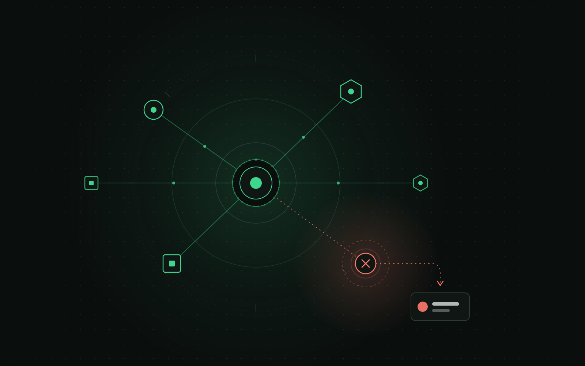
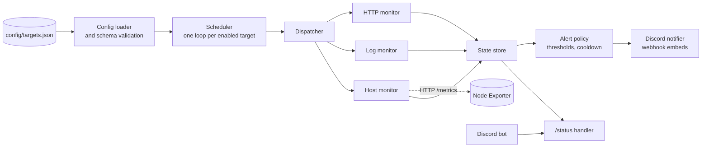

<p align="center">
  
</p>

<h1 align="center">Monitora</h1>

<p align="center">
  A small, configurable monitoring service that checks web services, log files and host metrics, tracks their state, and sends alerts to Discord when something changes.
</p>

<p align="center">
  <sub>The illustration above is conceptual artwork. Monitora has no graphical interface; it runs as a headless service.</sub>
</p>

## Table of contents

- [Overview](#overview)
- [Features](#features)
- [Architecture](#architecture)
- [How it works](#how-it-works)
- [Tech stack](#tech-stack)
- [Project structure](#project-structure)
- [Getting started](#getting-started)
- [Configuration](#configuration)
- [Development and validation](#development-and-validation)
- [Security](#security)
- [Current status and limitations](#current-status-and-limitations)
- [Documentation](#documentation)

## Overview

Monitora watches a list of targets that you define in a single JSON file. Each target is checked on its own schedule, the result updates that target's state (`UNKNOWN`, `UP` or `DOWN`), and relevant changes are reported to a Discord channel through a webhook. Adding or removing a monitored service means editing the configuration, not the code.

It is meant for small setups, such as a personal server, a side project or a handful of internal services, where a full monitoring stack would be more than needed. It runs in Docker, so Node.js does not need to be installed on the machine that hosts it.

Monitora is a personal project in active development. It covers the scope originally planned for it (see [Current status and limitations](#current-status-and-limitations)), but it has not been hardened for large-scale production use.

## Features

**Monitoring**

- **HTTP checks**: a target is healthy when it answers with a 2xx or 3xx status within the timeout. Redirects are not followed. 4xx and 5xx responses, timeouts, DNS failures, refused connections and TLS errors count as failures.
- **Log checks**: reads a log file incrementally and looks for configurable substring patterns in new lines. It handles file rotation, truncation and re-creation.
- **Host checks**: reads CPU, memory and disk usage from a [Node Exporter](https://github.com/prometheus/node_exporter) and compares them to configurable thresholds. A Node Exporter service is included in `docker-compose.yml`.

**State and alerting**

- A per-target state machine (`UNKNOWN`, `UP`, `DOWN`) with configurable failure and recovery thresholds for HTTP and host targets.
- Downtime is calculated and reported when a target recovers.
- Alerts are sent to Discord as embeds through webhooks, with a cooldown so a persistent problem does not flood the channel. Recovery notifications are sent separately and are not delayed by the cooldown.
- Each target chooses its own webhook through an environment variable name, so different targets can notify different channels.

**Discord bot (optional)**

- A `/status` slash command that replies with the last known state of every enabled target. It reads in-memory state and does not run any new check. If the bot credentials are not set, Monitora runs normally without it.

**Configuration and operations**

- Targets, defaults and thresholds live in `config/targets.json`, validated at startup with clear error messages. Invalid configuration stops the process instead of failing silently.
- Secrets stay in environment variables. The configuration file only references their names.
- Each target runs in its own loop, with no overlapping checks, and a failing check never stops the others.
- Graceful shutdown on `SIGTERM` and `SIGINT`.

## Architecture



| Component | Location | Responsibility |
| --- | --- | --- |
| Entry point | `src/index.ts` | Loads the configuration, wires every component together, starts the optional bot and handles shutdown. |
| Config loader and schema | `src/config/` | Reads `config/targets.json`, validates it, applies `defaults` to each target and checks that the referenced environment variables exist for enabled targets. |
| Scheduler | `src/monitoring/scheduler.ts` | Runs one independent loop per enabled target. A check never overlaps with the previous check of the same target. |
| Dispatcher | `src/monitoring/dispatch.ts` | Routes each target to the monitor that matches its `type`. |
| Monitors | `src/monitoring/http-monitor.ts`, `src/logs/`, `src/system/` | Perform the checks and return a normalized `CheckResult`. |
| State store | `src/monitoring/state-store.ts` | Keeps each target's state in memory and reports state transitions, including downtime. |
| Alert policy | `src/monitoring/alert-policy.ts` | Decides whether a result or transition should produce an alert (`DOWN`, `RECOVERED`, `LOG_MATCH` or `HOST_THRESHOLD`), applying the cooldown. |
| Discord notifier | `src/discord/notifier.ts` | Builds the embed for each alert type and delivers it to the target's webhook. Delivery failures are logged and never crash the process. |
| Discord bot and `/status` | `src/discord/bot.ts`, `src/commands/status.ts` | Registers the slash command and formats the response from the state store. The formatting logic is a pure function with no dependency on `discord.js`. |

More detail, including the architectural rules the project follows, is in [`docs/ARCHITECTURE.md`](docs/ARCHITECTURE.md).

## How it works

1. **Configure.** You list the targets in `config/targets.json` and put secrets, such as webhook URLs, in `.env`.
2. **Start.** On startup, Monitora validates the configuration. If anything is invalid or a referenced environment variable is missing, it logs the problem and exits.
3. **Check.** The scheduler runs each enabled target at its own interval. The dispatcher picks the HTTP, log or host monitor and gets back a result.
4. **Update state.** The state store records the result. A target moves to `DOWN` after `failureThreshold` consecutive failures and back to `UP` after `recoveryThreshold` consecutive successes.
5. **Decide.** The alert policy turns state changes into alert events: `DOWN` and `RECOVERED` for HTTP targets, `HOST_THRESHOLD` and `RECOVERED` for host targets. A log target produces a `LOG_MATCH` event when new lines match a pattern. Repeated reminders for a target that stays `DOWN` respect `cooldownSeconds`.
6. **Notify.** The notifier sends the event to the target's Discord webhook. If someone runs `/status`, the bot answers from the current in-memory state.

## Tech stack

| Technology | Role |
| --- | --- |
| Node.js 22 | Runtime. Checks use the built-in `fetch`, `node:fs` and timers, with no HTTP client library. |
| TypeScript (strict) | Language for the whole codebase. |
| [discord.js](https://discord.js.org/) | The only runtime dependency. Used for webhook delivery and the slash command bot. |
| Docker and Docker Compose | Packaging and local execution. The `Dockerfile` has `development`, `build` and `production` stages, and the production stage runs as the non-root `node` user. |
| Node Exporter | Source of host metrics, run as a companion container. |
| `tsx` and `node:test` | Development runner (watch mode) and test runner. `tsx` and TypeScript are development dependencies. |

## Project structure

```text
config/
  targets.example.json    public example configuration (versioned)
  targets.json            your real configuration (local, git-ignored)
docs/
  images/                 README artwork
  ARCHITECTURE.md         architecture and architectural rules
  CONFIGURATION.md        local vs. public configuration, secrets
  PROGRESS.md             development history and decisions
  PROJECT_BLUEPRINT.md    original project specification
src/
  commands/               /status response formatting
  config/                 configuration loading and validation
  discord/                bot (slash command) and notifier (webhook)
  logs/                   log monitor
  monitoring/             scheduler, dispatcher, HTTP monitor, state store, alert policy
  system/                 host monitor (Node Exporter metrics)
  types/                  shared domain types
  index.ts                entry point
tests/                    automated tests (node:test via tsx)
logs/                     git-ignored folder for local log files
.env.example              public example of the environment variables
docker-compose.yml        monitor service and Node Exporter
Dockerfile                development, build and production stages
```

## Getting started

### Prerequisites

- [Docker](https://docs.docker.com/get-docker/) with Docker Compose
- Git
- A Discord webhook URL, if you want alerts (`Channel settings → Integrations → Webhooks`)

Node.js is only needed if you want to run the scripts outside Docker (Node.js 22 or newer).

### Run with Docker

```bash
git clone https://github.com/JoaoOliveira20/Monitora.git
cd Monitora

cp .env.example .env
cp config/targets.example.json config/targets.json
```

Edit both files (see [Configuration](#configuration)). The example targets ship with `enabled: false`, so enable and adapt at least one. Then:

```bash
docker compose build
docker compose up
```

The container keeps running and checks the targets at their configured intervals. Stop it with `Ctrl+C`, or run `docker compose down` from another terminal.

`docker compose` starts the `development` stage of the `Dockerfile`: it mounts the project directory and runs `npm run dev`, which restarts the process when files in `src/` change. A `production` image can be built with `docker build --target production -t monitora .`. Docker Compose does not define a service for it, so you need to provide the environment variables and the configuration file yourself when running that image.

### Run without Docker

```bash
npm ci
npm run dev
```

Monitora does not read `.env` by itself: Docker Compose injects it. Outside Docker, export the variables in your shell before starting. The host monitor also needs a reachable Node Exporter, so use the URL of your own instance in `metricsUrl`.

### Useful Docker commands

| Command | What it does |
| --- | --- |
| `docker compose up -d` | Starts the stack in the background. |
| `docker compose logs -f monitor` | Follows the logs of the main service. |
| `docker compose restart monitor` | Restarts the service. Required after changing `.env` or `config/targets.json`, which are read only at startup. |
| `docker compose down` | Stops and removes the containers and the network. |

## Configuration

Two local files configure an installation. Neither is versioned, and both are in `.gitignore`. The repository ships public examples (`.env.example` and `config/targets.example.json`) that you copy. See [`docs/CONFIGURATION.md`](docs/CONFIGURATION.md) for the full local vs. public workflow.

### `.env`

| Variable | Required | Description |
| --- | --- | --- |
| `NODE_ENV` | No | `development` or `production`. The production image sets `production` itself. |
| `MONITOR_NAME` | No | Name shown in the startup log and in `/status`. Defaults to `Monitora`. |
| `MONITORA_CONFIG_PATH` | No | Path to the targets file. Defaults to `config/targets.json` in the working directory. |
| `DISCORD_WEBHOOK_MAIN` | Only if a target references it | Example of a webhook variable. The name is not fixed: each target points to the variable it wants through `discordWebhookEnv`, and you can define as many as you need. The value is the full webhook URL. |
| `DISCORD_WEBHOOK_URL` | No | Reserved. No code reads it today. |
| `DISCORD_TOKEN` | Only for the bot | Discord bot token. Without it, or without `DISCORD_CLIENT_ID`, the bot is disabled and the rest runs normally. |
| `DISCORD_CLIENT_ID` | Only for the bot | Application ID, needed to register the slash command. |
| `DISCORD_GUILD_ID` | No | If set, `/status` is registered only in that server and appears within seconds. If empty, it is registered globally and can take up to about an hour to propagate. |

### Discord bot setup

The `/status` command is optional. Alerts work without it.

1. Open the [Discord Developer Portal](https://discord.com/developers/applications) and create a **New Application**.
2. Under **Bot**, reset the token and put it in `DISCORD_TOKEN`. Treat it like a password.
3. Under **General Information**, copy the **Application ID** into `DISCORD_CLIENT_ID`.
4. Under **OAuth2 → URL Generator**, select the `bot` and `applications.commands` scopes (no extra bot permissions are needed), open the generated URL and add the bot to your server.
5. Start Monitora once. The log lists the connected servers with their IDs. Copy yours into `DISCORD_GUILD_ID`, then restart so the command registers instantly.

### `config/targets.json`

```json
{
  "version": 1,
  "defaults": {
    "intervalSeconds": 60,
    "timeoutMs": 5000,
    "failureThreshold": 2,
    "recoveryThreshold": 1,
    "cooldownSeconds": 900
  },
  "targets": [
    {
      "id": "example-website",
      "name": "Example Website",
      "type": "http",
      "enabled": true,
      "url": "https://example.com",
      "discordWebhookEnv": "DISCORD_WEBHOOK_MAIN"
    }
  ]
}
```

`defaults` apply to every target that does not override a value. `config/targets.example.json` shows all three target types.

Fields common to every target:

| Field | Required | Description |
| --- | --- | --- |
| `id` | Yes | Unique identifier, used to track state. |
| `name` | Yes | Human-readable name used in notifications and `/status`. |
| `type` | Yes | `http`, `log` or `host`. |
| `enabled` | Yes | Set to `false` to disable a target without removing it. |
| `intervalSeconds` | No | Seconds between checks. |
| `timeoutMs` | No | Check timeout in milliseconds. |
| `failureThreshold` | No | Consecutive failures before a target becomes `DOWN` and alerts. Applies to `http` and `host` only. A `log` target notifies on the first match. |
| `recoveryThreshold` | No | Consecutive successes before a `DOWN` target becomes `UP`. Applies to `http` and `host` only. |
| `cooldownSeconds` | No | Minimum time between repeated alerts while a problem persists. For `log` targets, the minimum time between match notifications. |
| `discordWebhookEnv` | Yes | Name of the environment variable that holds the webhook URL for this target. |
| `discordChannelId` | No | Reserved. Not used by any code today. |

Fields for `"type": "http"`:

| Field | Required | Description |
| --- | --- | --- |
| `url` | One of `url` or `urlEnv` | Full URL to check. |
| `urlEnv` | One of `url` or `urlEnv` | Name of an environment variable that holds the URL. Prefer this for internal or sensitive endpoints. |
| `method` | No | HTTP method. Defaults to `GET`. |

Fields for `"type": "log"`:

| Field | Required | Description |
| --- | --- | --- |
| `path` | Yes | Path of the log file **inside the container**. |
| `patterns` | Yes | List of plain substrings (not regular expressions). A new line containing any of them counts as a match. |

The log monitor starts reading at the end of the file on the first check, like `tail -f`, so existing content is ignored. Because the file usually lives on the host, mount it read-only in `docker-compose.yml` and point `path` to the container path:

```yaml
services:
  monitor:
    volumes:
      - .:/app
      - node_modules:/app/node_modules
      - /path/on/host/app.log:/var/log/monitored/app.log:ro
```

Fields for `"type": "host"`:

| Field | Required | Description |
| --- | --- | --- |
| `metricsUrl` | Yes | URL of a Node Exporter `/metrics` endpoint. The bundled service is reachable at `http://node-exporter:9100/metrics` from the `monitor` container. |
| `diskMountpoint` | No | Filesystem mountpoint used for the disk threshold. Defaults to `/`. |
| `cpuThresholdPercent`, `memoryThresholdPercent`, `diskThresholdPercent` | At least one when enabled | Usage percentage (0-100) above which the target is considered `DOWN`. |

CPU usage is computed from two consecutive readings of Node Exporter's cumulative counters, so it is only available from the second check of a new target onward.

> **Docker Desktop (Windows and macOS):** the "host" seen by Node Exporter is Docker Desktop's internal VM, not your physical machine, and the `/` mountpoint may not exist there. On a Linux host, `/` works as expected.

## Development and validation

| Command | What it does |
| --- | --- |
| `npm run dev` | Runs with automatic restart on file changes (used by `docker compose up`). |
| `npm run build` | Compiles TypeScript to `dist/`. |
| `npm start` | Runs the compiled `dist/index.js` (used by the production image). |
| `npm run typecheck` | Type checks without emitting files. |
| `npm test` | Runs the test suite with `node:test`. |

The suite has 141 tests in 15 files covering configuration validation, the state machine, the alert policy, the scheduler, each monitor, the Discord notifier and the `/status` response. Network tests use short-lived local servers and the Discord tests use mocks, so nothing depends on real credentials. No coverage report or CI pipeline is set up yet.

## Security

- Never commit `.env`, tokens, webhook URLs or sensitive internal URLs. `.env` and `config/targets.json` are git-ignored.
- A Discord webhook URL is a credential, because it contains a token. Treat it like a password.
- Error messages in logs and alerts describe the failure (for example "connection refused") and never include the full target URL or the webhook URL.
- For `log` targets, the matching line (truncated to 500 characters) is sent to Discord. Monitora does not detect or redact secrets inside log lines, so choose patterns that avoid sensitive output or keep secrets out of the monitored logs.

## Current status and limitations

Monitora implements what was planned for its first version: configurable HTTP, log and host monitoring, the state machine, Discord alerts with cooldown, and the `/status` command. It is a working project, not a hardened product.

- **State is in memory.** Restarting the container clears monitoring history, log read offsets, the CPU baseline and what `/status` reports. There is no database.
- **Configuration is read once.** Changes to `.env` or `config/targets.json` need a restart.
- **Discord is the only notification channel.** The bot only has the `/status` command; there is no way to pause or resume a target from Discord.
- **The host monitor needs a reachable Node Exporter.** Without it, each check fails with a clear error.
- **No interface.** There is no web dashboard or API; status is available through logs, alerts and `/status`.

No roadmap is committed beyond the current scope.

## Documentation

- [`docs/ARCHITECTURE.md`](docs/ARCHITECTURE.md): architecture and architectural rules
- [`docs/CONFIGURATION.md`](docs/CONFIGURATION.md): local vs. public configuration and secrets
- [`docs/PROGRESS.md`](docs/PROGRESS.md): development history and decisions
- [`docs/PROJECT_BLUEPRINT.md`](docs/PROJECT_BLUEPRINT.md): original specification

Most of the supporting documents are written in Portuguese.

This repository does not currently include a license file.
